# 🏛️ PromptusMaximus.Core

**The foundational library for speaking like Caesar and debugging like a gladiator.**

PromptusMaximus.Core is the foundational .NET library that provides the core architecture, models, interfaces, and services for the PromptusMaximus application suite. It serves as the shared foundation for all PromptusMaximus components, enabling AI-powered text translation with Roman-style theatrical flair.

---

## 📋 Project Overview

PromptusMaximus.Core is a .NET 9.0 class library that provides:

- **Core Models**: Data structures for GitHub Models and their capabilities
- **Service Interfaces**: Contracts for AI model interactions and session management
- **Configuration Management**: Session settings, language preferences, and secure credential storage
- **Security Services**: Cross-platform data encryption and protection
- **Extension Methods**: Utility functions for string manipulation and formatting

This library forms the backbone of the PromptusMaximus ecosystem, providing consistent APIs and shared functionality across console applications, web services, and other components.

---

## 🏗️ Architecture

The library follows a clean architecture pattern with clear separation of concerns:

```mermaid
classDiagram
    %% Models Layer
    class GitHubModel {
        +String Id
        +String Name
        +String Registry
        +String Publisher
        +String Summary
        +String RateLimitTier
        +String HtmlUrl
        +String Version
        +List~String~ Capabilities
        +GitHubModelLimits Limits
        +List~String~ Tags
        +List~String~ SupportedInputModalities
        +List~String~ SupportedOutputModalities
    }
    
    class GitHubModelLimits {
        +int? MaxInputTokens
        +int? MaxOutputTokens
    }
    
    class GitHubModelCollection {
        +IReadOnlyList~GitHubModel~ Models
        +int Count
        +Add(GitHubModel model)
        +AddRange(IEnumerable~GitHubModel~ models)
        +Remove(GitHubModel model) bool
        +Clear()
        +GetByPublisher(string publisher) IEnumerable~GitHubModel~
        +GetByCapability(string capability) IEnumerable~GitHubModel~
        +GetByTag(string tag) IEnumerable~GitHubModel~
        +GetEnumerator() IEnumerator~GitHubModel~
    }
    
    %% Interfaces Layer
    class IModelsClient {
        <<interface>>
        +GetModelsAsync(string ghToken, CancellationToken cancellationToken) Task~GitHubModelCollection~
    }
    
    class IModelsService {
        <<interface>>
        +CompleteAsync(string modelName, string prompt, string ghToken, Languages language, CancellationToken cancellationToken) Task~string~
    }
    
    class ISessionManager {
        <<interface>>
        +SessionSettings CurrentSettings
        +LoadSettingsAsync() Task
        +SaveSettingsAsync() Task
        +ClearAllSettingsAsync(bool deleteFiles) Task
        +SetModel(string model)
        +SetLanguage(Languages language)
        +SetGitHubToken(string token)
        +GetGitHubToken() string?
        +SetSecret(string key, string value)
        +GetSecret(string key) string?
        +SetSetting(string key, string value)
        +GetSetting(string key) string?
    }
    
    class IProtectedDataProvider {
        <<interface>>
        +ProtectAsync(byte[] data, string? optionalEntropy) Task~byte[]~
        +UnprotectAsync(byte[] encryptedData, string? optionalEntropy) Task~byte[]~
    }
    
    %% Configuration Layer
    class SessionSettings {
        +String? Model
        +Languages Language
        +Dictionary~string, string~ CustomSettings
        +Dictionary~string, string~ Secrets
    }
    
    class Languages {
        <<enumeration>>
        en
        it
    }
    
    class SessionManager {
        -IProtectedDataProvider _protectedDataProvider
        -SessionSettings _currentSettings
        +SessionSettings CurrentSettings
        +LoadSettingsAsync() Task
        +SaveSettingsAsync() Task
        +ClearAllSettingsAsync(bool deleteFiles) Task
        +SetModel(string model)
        +SetLanguage(Languages language)
        +SetGitHubToken(string token)
        +GetGitHubToken() string?
        +SetSecret(string key, string value)
        +GetSecret(string key) string?
        +SetSetting(string key, string value)
        +GetSetting(string key) string?
    }
    
    %% Security Layer
    class WindowsProtectedDataProvider {
        +ProtectAsync(byte[] data, string? optionalEntropy) Task~byte[]~
        +UnprotectAsync(byte[] encryptedData, string? optionalEntropy) Task~byte[]~
    }
    
    class LinuxProtectedDataProvider {
        -const int KeySize
        -const int IvSize
        +ProtectAsync(byte[] data, string? optionalEntropy) Task~byte[]~
        +UnprotectAsync(byte[] encryptedData, string? optionalEntropy) Task~byte[]~
        -GenerateKeyAsync(string? optionalEntropy) Task~byte[]~
    }
    
    class ProtectedDataProviderFactory {
        <<static>>
        +Create() IProtectedDataProvider
    }
    
    %% Extensions Layer
    class StringExtensions {
        <<static>>
        +Mask(string input, char maskCharacter, int visibleCharacters) string
        +MaskStringBothEnds(string input, int visibleStartCharacters, int visibleEndCharacters, char maskCharacter) string
    }
    
    %% Relationships
    GitHubModel --> GitHubModelLimits : contains
    GitHubModelCollection --> GitHubModel : aggregates
    
    SessionManager ..|> ISessionManager : implements
    SessionManager --> SessionSettings : uses
    SessionManager --> IProtectedDataProvider : uses
    SessionSettings --> Languages : uses
    
    WindowsProtectedDataProvider ..|> IProtectedDataProvider : implements
    LinuxProtectedDataProvider ..|> IProtectedDataProvider : implements
    ProtectedDataProviderFactory --> IProtectedDataProvider : creates
    ProtectedDataProviderFactory --> WindowsProtectedDataProvider : creates
    ProtectedDataProviderFactory --> LinuxProtectedDataProvider : creates
    
    IModelsClient --> GitHubModelCollection : returns
    IModelsService --> Languages : uses
```



### **Models (`Models/`)**

- `GitHubModel`: Represents AI models available through GitHub Models API
- `GitHubModelCollection`: Type-safe collection for managing multiple models
- `GitHubModelLimits`: Token limits and constraints for model usage

### **Interfaces (`Interfaces/`)**

- `IModelsClient`: Contract for GitHub Models API interaction
- `IModelsService`: Service layer for AI model operations
- `ISessionManager`: Session state and configuration management

### **Configuration (`Configuration/`)**

- `SessionSettings`: User preferences and application state
- `SessionManager`: Persistent configuration and secure storage
- `Languages`: Supported language enumeration

### **Security (`Security/`)**

- `IProtectedDataProvider`: Cross-platform encryption interface
- `WindowsProtectedDataProvider`: Windows DPAPI implementation
- `LinuxProtectedDataProvider`: AES encryption for Linux/macOS
- `ProtectedDataProviderFactory`: Platform-specific provider creation

### **Extensions (`Extensions/`)**

- `StringExtensions`: String masking and formatting utilities

---

## 🔧 Key Features

### **Cross-Platform Security**
```csharp
// Automatic platform detection and encryption
var provider = ProtectedDataProviderFactory.Create();
var encrypted = await provider.ProtectAsync(sensitiveData);
```

### **Session Management**
```csharp
// Persistent configuration with secure credential storage
var sessionManager = new SessionManager();
await sessionManager.LoadSettingsAsync();

sessionManager.SetModel("gpt-4o");
sessionManager.SetLanguage(Languages.en);
sessionManager.SetGitHubToken("your-secret-token");

await sessionManager.SaveSettingsAsync();
```

### **Type-Safe Model Collections**
```csharp
var models = new GitHubModelCollection();
models.Add(new GitHubModel { Name = "gpt-4o", Publisher = "OpenAI" });

// Query by capabilities
var chatModels = models.GetByCapability("chat-completion");
var openAIModels = models.GetByPublisher("OpenAI");
```

### **Secure String Operations**
```csharp
// Built-in string masking for sensitive data
string token = "ghp_1234567890abcdef";
string masked = token.Mask(); // Returns "ghp_************cdef"
```

---

## 📦 External Dependencies

The library has minimal external dependencies to maintain portability and performance:

### **NuGet Packages**

#### `System.Security.Cryptography.ProtectedData` (v10.0.0-rc.1.25451.107)
- **Purpose**: Provides Windows Data Protection API (DPAPI) support for secure credential storage
- **Platform**: Windows-specific encryption using user-context protection
- **Usage**: Encrypts sensitive data like GitHub tokens on Windows platforms
- **License**: MIT License (Microsoft)

### **.NET Runtime Dependencies**
- **.NET 9.0**: Target framework providing modern C# features and performance improvements
- **System.Text.Json**: Built-in JSON serialization for configuration persistence
- **System.Security.Cryptography**: AES encryption implementation for cross-platform security

---

## 🔒 Security Model

### **Credential Protection**
- **Windows**: Uses DPAPI (Data Protection API) for user-scoped encryption
- **Linux/macOS**: Implements AES-256 encryption with PBKDF2 key derivation
- **Key Material**: Derived from user identity and machine characteristics
- **Entropy**: Optional additional entropy for enhanced security

### **Configuration Storage**
- **Location**: `~/.promptusmaximus/` directory in user profile
- **Settings**: Plain JSON for non-sensitive configuration
- **Secrets**: Encrypted binary files for tokens and credentials
- **Permissions**: User-only access on supported platforms

### **Data Flow**
```
User Input → SessionManager → ProtectedDataProvider → Platform-Specific Encryption → Secure Storage
```

---

## 🌐 Platform Support

| Platform | Encryption Method | Key Storage | Status |
|----------|------------------|-------------|---------|
| Windows 10/11 | DPAPI | User Profile | ✅ Supported |
| Linux | AES-256 + PBKDF2 | User Profile | ✅ Supported |
| macOS | AES-256 + PBKDF2 | User Profile | ✅ Supported |

---

## 🧪 Usage Examples

### **Basic Session Management**
```csharp
using PromptusMaximus.Core.Configuration;
using PromptusMaximus.Core.Interfaces;

// Initialize session manager
ISessionManager session = new SessionManager();
await session.LoadSettingsAsync();

// Configure settings
session.SetModel("gpt-4o");
session.SetLanguage(Languages.en);
session.SetGitHubToken("ghp_your_token_here");

// Persist changes
await session.SaveSettingsAsync();

// Retrieve settings
var currentModel = session.CurrentSettings.Model;
var token = session.GetGitHubToken();
```

### **Working with GitHub Models**
```csharp
using PromptusMaximus.Core.Models;

// Create and populate model collection
var models = new GitHubModelCollection();
models.Add(new GitHubModel 
{
    Id = "gpt-4o",
    Name = "GPT-4o",
    Publisher = "OpenAI",
    Capabilities = ["chat-completion", "text-generation"],
    Tags = ["general", "conversation"]
});

// Query models
var chatModels = models.GetByCapability("chat-completion");
var openAIModels = models.GetByPublisher("OpenAI");

// Display information
foreach (var model in models)
{
    Console.WriteLine($"Model: {model.Name} by {model.Publisher}");
}
```

### **Cross-Platform Encryption**
```csharp
using PromptusMaximus.Core.Security;

// Automatic platform detection
var provider = ProtectedDataProviderFactory.Create();

// Encrypt sensitive data
string secretToken = "my-secret-api-key";
byte[] dataToEncrypt = Encoding.UTF8.GetBytes(secretToken);
byte[] encryptedData = await provider.ProtectAsync(dataToEncrypt);

// Decrypt when needed
byte[] decryptedData = await provider.UnprotectAsync(encryptedData);
string recoveredToken = Encoding.UTF8.GetString(decryptedData);
```

---

## 🔧 Integration

### **Console Applications**
```csharp
// Dependency injection setup
services.AddSingleton<ISessionManager, SessionManager>();
services.AddSingleton<IProtectedDataProvider>(_ => 
    ProtectedDataProviderFactory.Create());
```

### **Web Applications**
```csharp
// Configure in Startup.cs or Program.cs
builder.Services.AddScoped<ISessionManager, SessionManager>();
builder.Services.AddSingleton<IProtectedDataProvider>(_ => 
    ProtectedDataProviderFactory.Create());
```

---

## 📄 License

This project is licensed under the MIT License. See the [LICENSE](../LICENSE) file in the root directory for the full license text.

---

## 🤝 Contributing

PromptusMaximus.Core is part of the larger PromptusMaximus project. Contributions are welcome! Please:

1. Follow the existing code style and patterns
2. Add appropriate unit tests for new functionality
3. Update documentation for public APIs
4. Ensure cross-platform compatibility

---

## 🔗 Related Projects

- **PromptusMaximus.Console**: Command-line interface built on this core library
- **GitHubModels.Client**: HTTP client for GitHub Models API integration

---

## 📚 API Reference

For detailed API documentation, see the XML documentation comments in the source code. The library provides comprehensive IntelliSense support and follows .NET documentation standards.
